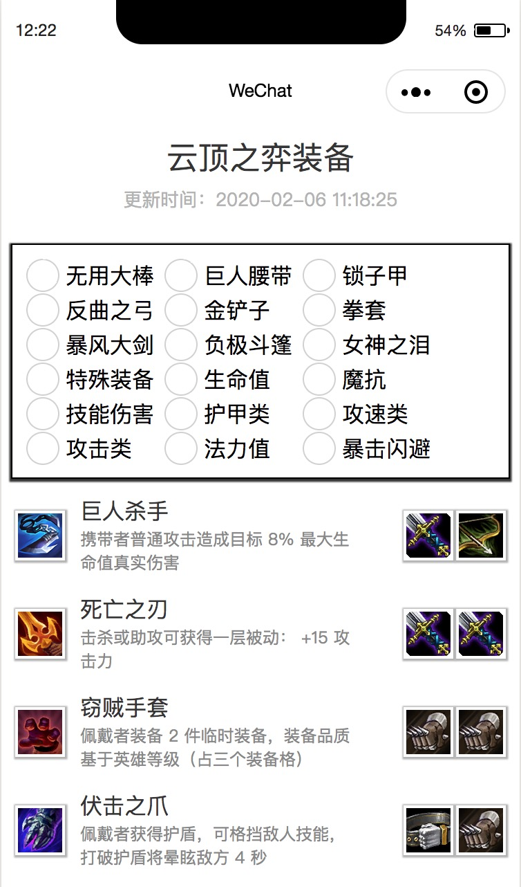
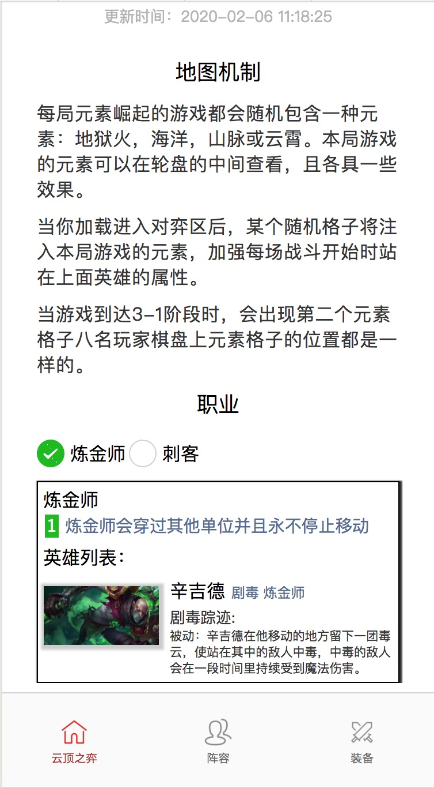

# 云顶之弈助手微信小程序

使用 taro 框架开发，目前可以适配微信小程序，百度，支付宝小程序等

## 项目状态

正在开发中。

## 功能预览

装备合成：




游戏简介：



## 功能列表

- 游戏简单介绍
- 职业介绍
- 元素介绍
- 版本阵容推荐
- 装备合成

## 使用的组件

- react
- taro
- mobx

## 基本使用说明

简单说明：
``` shell
git clone git@github.com:smileboywtu/yundingbanlv.git
cd yundingbanlv
npm i
npm run dev:weapp
```

使用微信小程序开发工具打开目录即可预览。